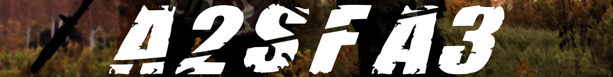

 <h1 align="center"><b>ArmA 2 Sounds For ArmA 3</b></h1>

<i>by <a href="https://steamcommunity.com/profiles/76561198050952156">MAXIMILI</a></i>

<h4>MAIN INFO</h4><ul>
    <li>Modification prefix: <code>A2SFA3</code>.</li>
    <li>Main sound files located in <code>/a2sfa3_data</code>.</li>
    <li>Directories with postfix <code>*_c</code> used for config parts.</li>
</ul>

<h4>LINKS TO MOD</h4><ul>
    <li><a href="https://steamcommunity.com/sharedfiles/filedetails/?id=1116074802">Steam Workshop</a></li>
    <li><a href="http://www.armaholic.com/page.php?id=33165">Armaholic</a><i> (login required)</i></li>
</ul>

<h4>LINKS TO AUTHOR</h4><ul>
    <li><a href="https://steamcommunity.com/profiles/76561198050952156">Steam</a></li>
    <li><a href="https://forums.bohemia.net/profile/1139060-maximilionus/">BI Forums</a></li>
    <li><a href="http://www.armaholic.com/users.php?m=details&id=92552&u=maximilionus">Armaholic</a></li>
    <li><a href="https://www.youtube.com/channel/UCs1B4MO3rYNuL0Gz89KGEkg">YouTube (Workbench)</a></li>
</ul>